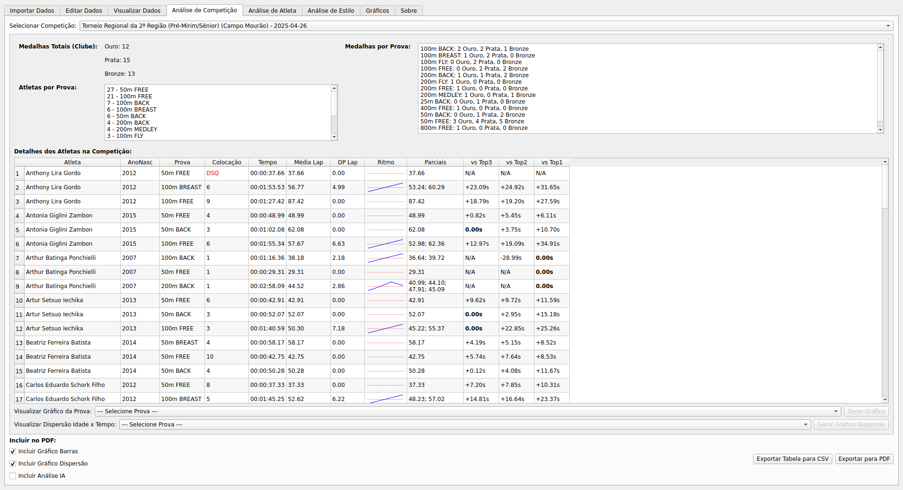
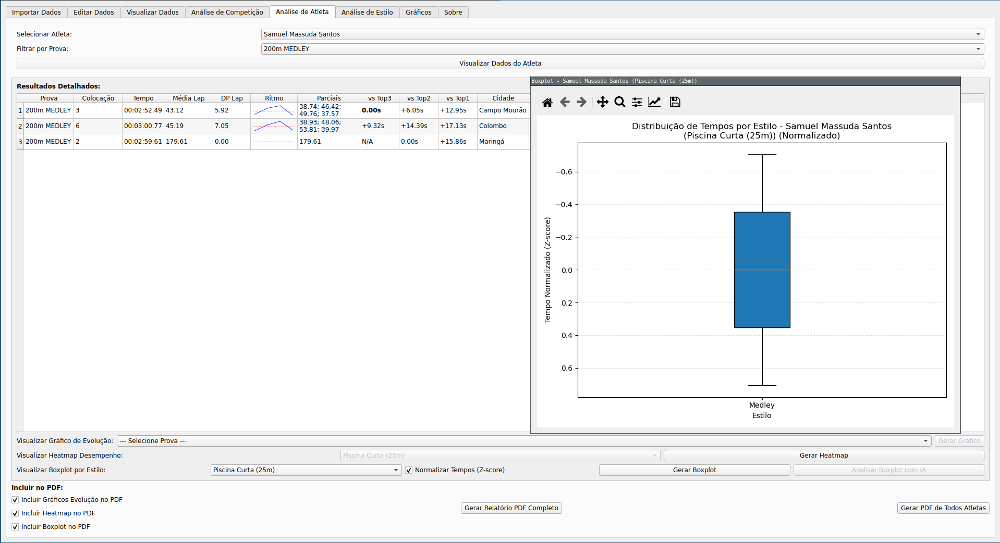

# NadosApp - Analisador de Dados de Natação

O NadosApp é uma aplicação desktop desenvolvida em Python com PySide6, projetada para auxiliar técnicos, atletas e analistas de natação na importação, gerenciamento e análise de dados de competições no formato LENEX (.lef, .lxf).

## Visão Geral

A natação competitiva gera uma grande quantidade de dados valiosos que, quando bem analisados, podem fornecer insights cruciais sobre o desempenho dos atletas e equipes. O NadosApp visa simplificar o processo de extração desses dados de arquivos LENEX, armazená-los em um banco de dados local (SQLite) e oferecer ferramentas visuais e relatórios para uma análise aprofundada.

## Funcionalidades Principais

*   **Importação de Dados LENEX:** Permite selecionar múltiplos arquivos LENEX (.lef ou .lxf) e importar informações sobre competições, clubes, atletas, provas e resultados para um banco de dados centralizado.
*   **Visualização de Dados:** Oferece uma interface para visualizar os dados brutos importados, permitindo consultas e filtros básicos.
*   **Gerenciamento de Competições:** Possibilita a edição de detalhes das competições importadas.
*   **Análise Detalhada:**
    *   **Resumos de Competição:** Gera um sumário completo de uma competição selecionada, incluindo estatísticas de medalhas, recordes e participação.
    *   **Relatórios Individuais por Atleta:** Cria relatórios detalhados para atletas específicos, mostrando seu histórico de tempos, parciais, comparação com o top 3, gráficos de evolução, heatmap de desempenho, boxplot de consistência e análise de ritmo.
    *   **Relatórios por Estilo de Nado:** Permite analisar o desempenho em um estilo de nado específico (Livre, Costas, Peito, Borboleta, Medley), com filtros por prova, gênero e ano de nascimento. Inclui gráficos de evolução, ranking de melhores atletas e análise de densidade (idade vs. tempo).
*   **Geração de Relatórios em PDF:** Todas as abas de análise (Resumo da Competição, Relatório Atleta, Relatório Estilo) permitem a exportação dos dados e gráficos visualizados para arquivos PDF formatados, facilitando o compartilhamento e a impressão das análises.
*   **Exportação para CSV:** Algumas tabelas de dados podem ser exportadas para o formato CSV para uso em outras ferramentas de análise.
*   **Configuração do Clube Alvo:** Permite que o usuário defina o nome do seu clube para filtrar e destacar os resultados relevantes durante a importação e análise.

## Descrição das Abas

A interface do NadosApp é organizada em abas, cada uma com uma funcionalidade específica:

### 1. Importar Dados
*   **Função:** Responsável pela importação dos dados de arquivos LENEX.
*   **Recursos:**
    *   Campo para definir o "Nome do Clube Alvo" (o nome exato do seu clube como consta nos arquivos LENEX). Uma dica é fornecida para ajudar a encontrar este nome.
    *   Botão para selecionar um ou mais arquivos LENEX (.lef, .lxf).
    *   Lista dos arquivos selecionados.
    *   Botão para iniciar o processo de importação.
    *   Barra de progresso e área de log para acompanhar o status da importação.

### 2. Editar Dados das Competições
*   **Função:** Permite visualizar e modificar os detalhes das competições importadas.
*   **Recursos:**
    *   Lista de todas as competições no banco de dados.
    *   Ao selecionar uma competição, seus detalhes (nome, cidade, data, tipo de piscina) são exibidos em campos editáveis.
    *   Legenda explicativa para os tipos de piscina (SCM: 25m, LCM: 50m).
    *   Botão para salvar as alterações.

### 3. Visualizar Dados
*   **Função:** Permite ao usuário visualizar e consultar os dados brutos armazenados no banco de dados.
*   **Recursos:**
    *   Seleção de tabelas do banco de dados (Atletas, Competições, Resultados, etc.).
    *   Exibição dos dados da tabela selecionada em formato tabular.
    *   Opções de filtro e ordenação.

### 4. Análise de Competição
*   **Função:** Gera um relatório resumido de uma competição específica.
*   **Recursos:**
    *   Seleção da competição desejada.
    *   Exibição de informações gerais da competição (data, local, piscina).
    *   Resumo de medalhas por clube.
    *   Lista de recordes quebrados.
    *   Estatísticas de participação.
    *   Opções para incluir gráficos de barras (ex: medalhas por clube) e gráficos de dispersão (ex: idade dos atletas vs. tempo) no PDF.
    *   Botões para exportar os dados da tabela para CSV e o relatório completo para PDF.

### 5. Análise Atleta
*   **Função:** Gera um relatório individual e detalhado para um atleta selecionado.
*   **Recursos:**
    *   Busca e seleção do atleta por nome ou licença.
    *   Exibição de todos os resultados do atleta, com tempos, parciais, ritmo, média e desvio padrão das voltas, e comparação com o top 3 da prova.
    *   Opções para incluir no PDF:
        *   Gráfico de evolução de tempos.
        *   Heatmap de desempenho (prova vs. percentil de tempo).
        *   Boxplot de consistência de tempos por prova.
        *   Análise de ritmo (se disponível).
    *   Botões para exportar os dados da tabela para CSV e o relatório completo para PDF.

### 6. Análise Estilo
*   **Função:** Permite uma análise focada em um estilo de nado específico (Livre, Costas, Peito, Borboleta, Medley).
*   **Recursos:**
    *   Seleção do estilo de nado.
    *   Filtros por prova específica (ex: 100m Livre), gênero e faixa de ano de nascimento.
    *   Tabela com os resultados filtrados, incluindo tempos, parciais, ritmo, e comparação com o top 3.
    *   Geração de PDF contendo, para cada prova dentro do estilo analisado:
        *   Tabela de melhor tempo por atleta naquela prova.
        *   Gráfico de evolução comparativa de tempos.
        *   Gráfico de barras com os top atletas da prova.
        *   Gráfico de densidade (idade vs. tempo, com cor representando a idade média).
    *   O PDF também inclui uma tabela final com o ranking da volta mais rápida para o estilo como um todo.
    *   Botões para gerar gráficos pop-up interativos (evolução, top atletas, densidade) e para exportar o relatório completo para PDF.

### 7. Sobre
*   **Função:** Apresenta informações sobre o NadosApp.
*   **Recursos:**
    *   Breve descrição do software.
    *   Informações sobre a licença (GNU GPLv3) com link para o texto completo.
    *   Nome do autor e informações de contato.

## Exemplos de PDF gerados pelo software:

Segue alguns exemplos de relatórios em PDF que podem ser gerados pelo programa:

* [Análise de atleta](img/Relatorio_Samuel_Massuda_Santos_Todos.pdf)

## Licença

Este programa é um software livre e é distribuído sob os termos da [Licença Pública Geral GNU versão 3 (GNU GPLv3)](https://www.gnu.org/licenses/gpl-3.0.html).

## Autor e Contato

*   **Autor:** Luiz Arthur Feitosa dos Santos
*   **Contato:** [luizsantos@utfpr.edu.br](mailto:luizsantos@utfpr.edu.br)

## Observação

* Este programa foi desenvolvido com o auxílio do Google Gemini, visando principalmente analisar as capacidades atuais da Inteligência Artificial (IA) no desenvolvimento de software.

* A análise de dados por IA integrada ao programa ainda não foi concluída; sua implementação está prevista para versões futuras.

* Este software está atualmente em fase de testes e desenvolvimento. Assim, seu uso é de inteira responsabilidade do usuário.