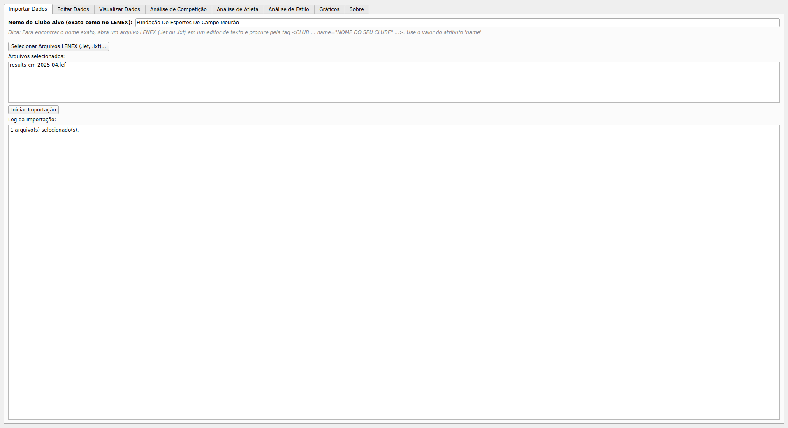
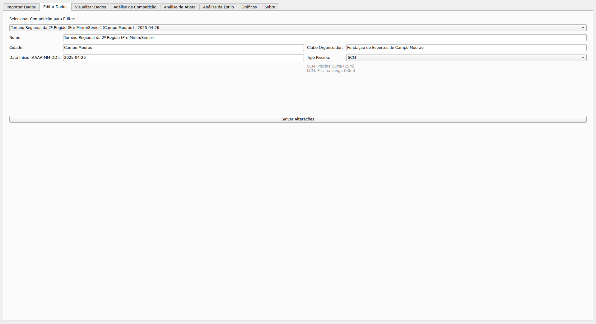
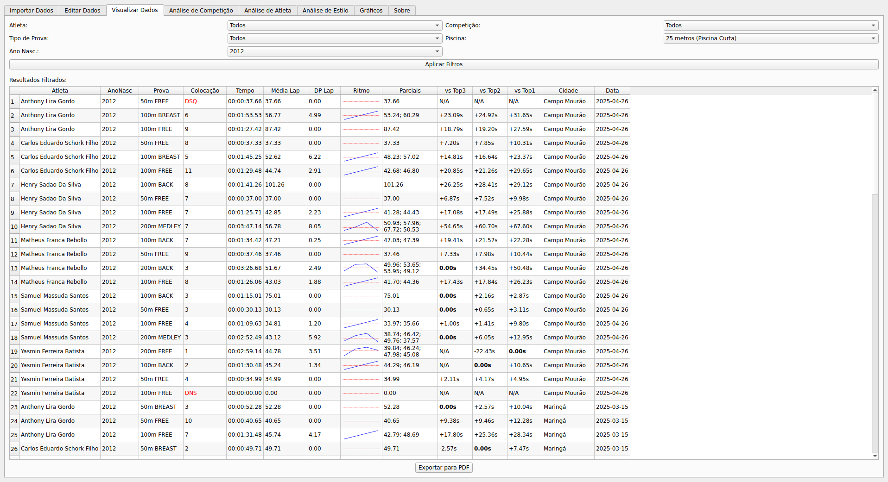
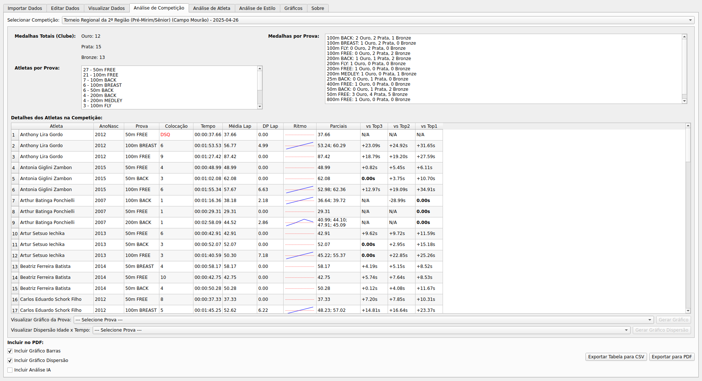
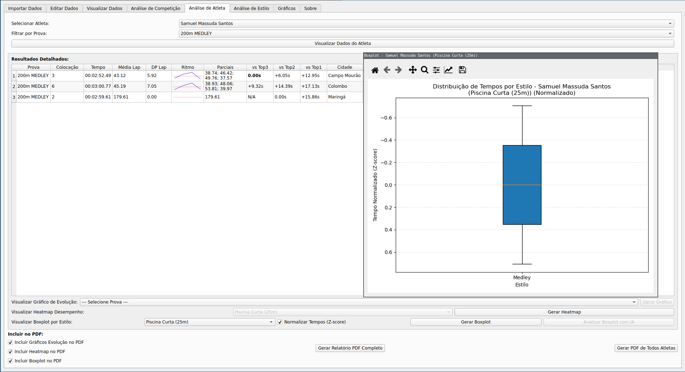
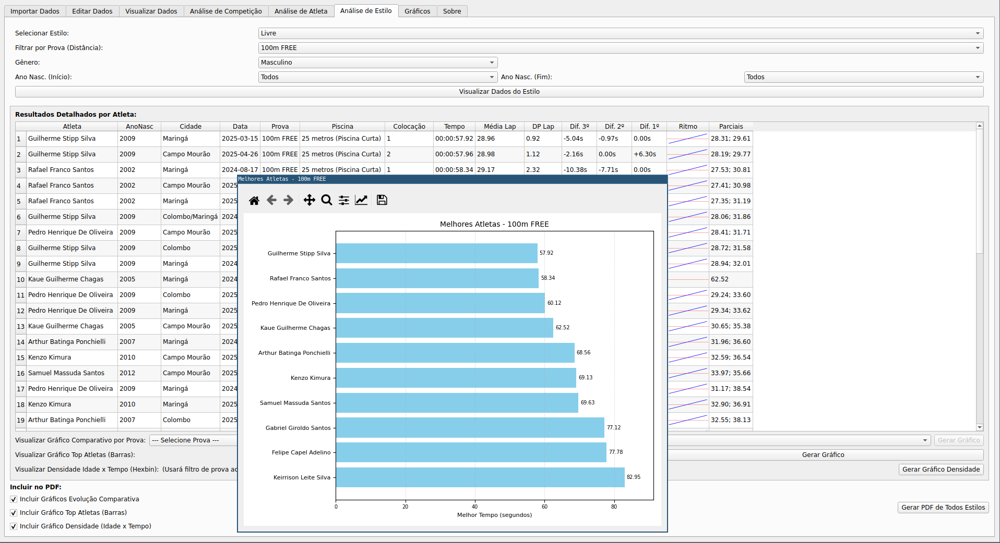

# NadosApp - Swimming Data Analyzer

NadosApp is a desktop application developed in Python with PySide6, designed to assist swimming coaches, athletes, and analysts in importing, managing, and analyzing competition data in the LENEX format (.lef, .lxf).

## Overview

Competitive swimming generates a large amount of valuable data that, when well-analyzed, can provide crucial insights into the performance of athletes and teams. NadosApp aims to simplify the process of extracting this data from LENEX files, storing it in a local database (SQLite), and offering visual tools and reports for in-depth analysis.

## Key Features

* **LENEX Data Import:** Allows selecting multiple LENEX files (.lef or .lxf) and importing information about competitions, clubs, athletes, events, and results into a centralized database.
* **Data Visualization:** Offers an interface to view the raw imported data, allowing basic queries and filters.
* **Competition Management:** Enables editing details of imported competitions.
* **Detailed Analysis:**
    * **Competition Summaries:** Generates a comprehensive summary of a selected competition, including medal statistics, records, and participation.
    * **Individual Athlete Reports:** Creates detailed reports for specific athletes, showing their time history, splits, comparison with the top 3, evolution charts, performance heatmap, consistency boxplot, and pace analysis.
    * **Stroke Style Reports:** Allows analyzing performance in a specific stroke style (Freestyle, Backstroke, Breaststroke, Butterfly, Medley), with filters by event, gender, and year of birth. Includes evolution charts, best athlete rankings, and density analysis (age vs. time).
* **PDF Report Generation:** All analysis tabs (Competition Summary, Athlete Report, Style Report) allow exporting the visualized data and charts to formatted PDF files, facilitating sharing and printing of analyses.
* **CSV Export:** Some data tables can be exported to CSV format for use in other analysis tools.
* **Target Club Configuration:** Allows the user to define their club's name to filter and highlight relevant results during import and analysis.

## Tab Descriptions

The NadosApp interface is organized into tabs, each with a specific functionality:

### 1. Import Data
* **Function:** Responsible for importing data from LENEX files.
* **Features:**
    * Field to define the "Target Club Name" (the exact name of your club as it appears in the LENEX files). A tip is provided to help find this name.
    * Button to select one or more LENEX files (.lef, .lxf).
    * List of selected files.
    * Button to start the import process.
    * Progress bar and log area to track the import status.

### 2. Edit Competition Data
* **Function:** Allows viewing and modifying the details of imported competitions.
* **Features:**
    * List of all competitions in the database.
    * When a competition is selected, its details (name, city, date, pool type) are displayed in editable fields.
    * Explanatory legend for pool types (SCM: 25m, LCM: 50m).
    * Button to save changes.

### 3. Visualize Data
* **Function:** Allows the user to view and query the raw data stored in the database.
* **Features:**
    * Selection of database tables (Athletes, Competitions, Results, etc.).
    * Display of the selected table data in tabular format.
    * Filter and sorting options.

### 4. Competition Analysis
* **Function:** Generates a summary report of a specific competition.
* **Features:**
    * Selection of the desired competition.
    * Display of general competition information (date, location, pool).
    * Medal summary by club.
    * List of broken records.
    * Participation statistics.
    * Options to include bar charts (e.g., medals per club) and scatter plots (e.g., athlete age vs. time) in the PDF.
    * Buttons to export the table data to CSV and the complete report to PDF.

### 5. Athlete Analysis
* **Function:** Generates an individual and detailed report for a selected athlete.
* **Features:**
    * Search and selection of the athlete by name or license.
    * Display of all the athlete's results, with times, splits, pace, average and standard deviation of laps, and comparison with the top 3 of the event.
    * Options to include in the PDF:
        * Time evolution chart.
        * Performance heatmap (event vs. time percentile).
        * Consistency boxplot of times per event.
        * Pace analysis (if available).
    * Buttons to export the table data to CSV and the complete report to PDF.

### 6. Style Analysis
* **Function:** Allows focused analysis on a specific stroke style (Freestyle, Backstroke, Breaststroke, Butterfly, Medley).
* **Features:**
    * Selection of the stroke style.
    * Filters by specific event (e.g., 100m Freestyle), gender, and birth year range.
    * Table with the filtered results, including times, splits, pace, and comparison with the top 3.
    * PDF generation containing, for each event within the analyzed style:
        * Table of the best time per athlete in that event.
        * Comparative time evolution chart.
        * Bar chart with the top athletes of the event.
        * Density chart (age vs. time, with color representing average age).
    * The PDF also includes a final table with the fastest lap ranking for the style as a whole.
    * Buttons to generate interactive pop-up charts (evolution, top athletes, density) and to export the complete report to PDF.

### 7. About
* **Function:** Presents information about NadosApp.
* **Features:**
    * Brief description of the software.
    * License information (GNU GPLv3) with a link to the full text.
    * Author's name and contact information.

## Examples of PDFs generated by the software:

Here are some examples of PDF reports that can be generated by the program:

* [Athlete Analysis](img/Relatorio_Samuel_Massuda_Santos_Todos.pdf)

## License

This program is free software and is distributed under the terms of the [GNU General Public License version 3 (GNU GPLv3)](https://www.gnu.org/licenses/gpl-3.0.html).

## Author and Contact

* **Author:** Luiz Arthur Feitosa dos Santos
* **Contact:** [luizsantos@utfpr.edu.br](mailto:luizsantos@utfpr.edu.br)

## Note

* This program was developed with the assistance of Google Gemini, primarily aiming to analyze the current capabilities of Artificial Intelligence (AI) in software development.

* The integration of AI-powered data analysis into the program has not yet been completed; its implementation is planned for future versions.

* This software is currently in the testing and development phase. Therefore, its use is the sole responsibility of the user.